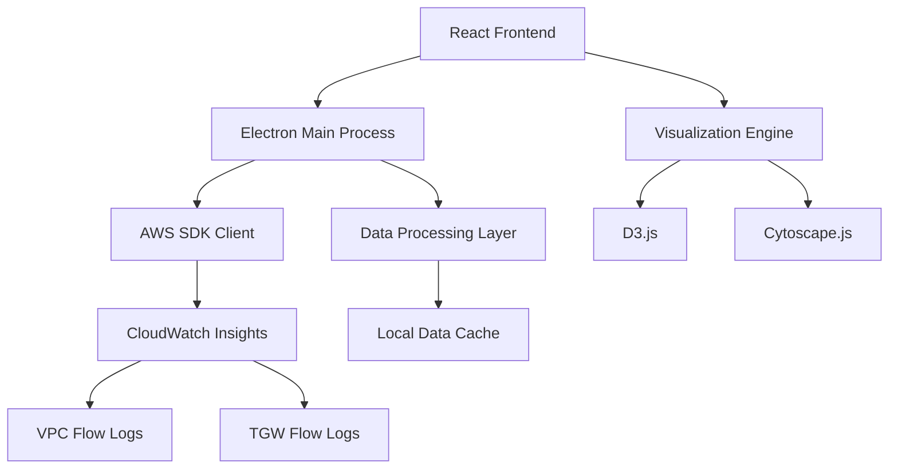

# Design Document

## Overview

The AWS Network Flow Visualizer will be built as a self-contained, cross-platform desktop application using Electron with a React frontend. This approach ensures consistent behavior across Linux, macOS, and Windows while leveraging powerful web-based visualization libraries. The application operates entirely offline except for necessary AWS API communications, with no telemetry or external service dependencies. The application will use the AWS SDK to query CloudWatch Insights, process VPC and Transit Gateway flow logs, and render interactive network topology visualizations.

## Architecture

### High-Level Architecture



### Technology Stack

- **Frontend**: React with TypeScript for type safety
- **Desktop Framework**: Electron for cross-platform compatibility
- **Visualization**: Cytoscape.js for network topology, D3.js for charts and timelines
- **AWS Integration**: AWS SDK for JavaScript v3
- **Data Processing**: Custom parsers for flow log formats
- **State Management**: Redux Toolkit for application state
- **Styling**: Tailwind CSS for responsive design

## Components and Interfaces

### 1. Main Application Components

#### AWS Connection Manager
- Handles AWS credential configuration and validation with emphasis on secure authentication
- Manages CloudWatch Insights client initialization
- Prioritizes AWS SSO and named profiles over long-term access keys
- Supports IAM roles, temporary credentials, and environment variables
- Integrates with AWS CLI credential chain for seamless profile usage

```typescript
interface AWSConnectionManager {
  authenticateWithSSO(ssoConfig: SSOConfig): Promise<boolean>;
  authenticateWithProfile(profileName: string): Promise<boolean>;
  authenticateWithRole(roleArn: string): Promise<boolean>;
  testConnection(): Promise<ConnectionStatus>;
  getAvailableProfiles(): Promise<string[]>;
  getAvailableRegions(): Promise<string[]>;
  refreshCredentials(): Promise<boolean>;
}
```

#### Flow Log Query Engine
- Constructs and executes CloudWatch Insights queries
- Handles pagination for large result sets
- Caches query results for performance

```typescript
interface FlowLogQueryEngine {
  queryVPCFlowLogs(params: VPCQueryParams): Promise<FlowLogRecord[]>;
  queryTGWFlowLogs(params: TGWQueryParams): Promise<FlowLogRecord[]>;
  buildQuery(filters: FlowFilters): string;
}
```

#### Network Topology Builder
- Processes flow log data to construct network topology
- Identifies VPCs, subnets, instances, and connections
- Calculates traffic statistics and patterns

```typescript
interface NetworkTopologyBuilder {
  buildTopology(flowLogs: FlowLogRecord[]): NetworkTopology;
  updateTopology(newFlowLogs: FlowLogRecord[]): void;
  getTrafficStats(): TrafficStatistics;
}
```

#### Visualization Renderer
- Renders interactive network diagrams using Cytoscape.js
- Provides zoom, pan, and selection capabilities
- Updates visualizations based on filters and time ranges

```typescript
interface VisualizationRenderer {
  renderTopology(topology: NetworkTopology): void;
  applyFilters(filters: FlowFilters): void;
  exportVisualization(format: ExportFormat): Promise<Blob>;
}
```

### 2. User Interface Components

#### Connection Configuration Panel
- AWS SSO configuration and login flow
- Named profile selection from AWS CLI configuration
- IAM role assumption interface
- Region and account selection
- Connection status indicators with credential expiration warnings

#### Query Builder Interface
- Time range selection (last hour, day, week, custom)
- Resource filters (VPC IDs, instance IDs, IP ranges)
- Protocol and port filters
- Query execution controls

#### Network Visualization Canvas
- Interactive network topology display
- Traffic flow animations with directional indicators
- Node and edge styling based on traffic volume
- Zoom and pan controls

#### Filter and Search Panel
- Real-time filtering controls
- Search functionality for IPs, ports, protocols
- Traffic statistics display
- Export options

#### Timeline View
- Traffic volume over time charts
- Anomaly detection indicators
- Time-based filtering controls

## Data Models

### Flow Log Record
```typescript
interface FlowLogRecord {
  timestamp: Date;
  sourceIP: string;
  destinationIP: string;
  sourcePort: number;
  destinationPort: number;
  protocol: string;
  action: 'ACCEPT' | 'REJECT';
  bytes: number;
  packets: number;
  accountId?: string;
  vpcId?: string;
  subnetId?: string;
  instanceId?: string;
}
```

### Network Topology
```typescript
interface NetworkTopology {
  nodes: NetworkNode[];
  edges: NetworkEdge[];
  metadata: TopologyMetadata;
}

interface NetworkNode {
  id: string;
  type: 'vpc' | 'subnet' | 'instance' | 'tgw' | 'vpn';
  label: string;
  properties: Record<string, any>;
  position?: { x: number; y: number };
}

interface NetworkEdge {
  id: string;
  source: string;
  target: string;
  trafficStats: TrafficStatistics;
  flowRecords: FlowLogRecord[];
}
```

### Traffic Statistics
```typescript
interface TrafficStatistics {
  totalBytes: number;
  totalPackets: number;
  acceptedConnections: number;
  rejectedConnections: number;
  uniqueSourceIPs: number;
  uniqueDestinationIPs: number;
  topPorts: PortStatistic[];
  timeRange: { start: Date; end: Date };
}
```

## Error Handling

### AWS Connection Errors
- Invalid credentials: Display clear authentication guidance
- Network connectivity issues: Provide retry mechanisms with exponential backoff
- Permission errors: Show specific IAM policy requirements
- Rate limiting: Implement automatic retry with appropriate delays

### Data Processing Errors
- Malformed flow log records: Log errors and continue processing valid records
- Large dataset handling: Implement streaming and pagination to prevent memory issues
- Query timeouts: Provide progress indicators and cancellation options

### Visualization Errors
- Rendering performance: Implement data sampling for large topologies
- Browser compatibility: Graceful degradation for unsupported features
- Export failures: Provide alternative export formats and error recovery

## Testing Strategy

### Unit Testing
- AWS SDK integration mocking using Jest
- Flow log parsing and data transformation logic
- Network topology building algorithms
- Visualization component rendering

### Integration Testing
- End-to-end AWS CloudWatch Insights queries
- Data flow from query to visualization
- Cross-platform compatibility testing on Linux, macOS, and Windows
- Performance testing with large datasets

### User Acceptance Testing
- Network troubleshooting workflow validation
- Visualization accuracy against known network configurations
- Export functionality verification
- Filter and search capability testing

### Performance Testing
- Large flow log dataset processing (1M+ records)
- Real-time visualization updates
- Memory usage optimization
- Query response time benchmarking

## Security Considerations

### Self-Contained Architecture
- Completely offline operation except for AWS API calls
- No telemetry, analytics, or usage data collection
- No communication with external services beyond AWS APIs
- All dependencies bundled within the application package
- No automatic updates or external update checks

### Credential Management
- Primary support for AWS SSO authentication with automatic token refresh
- Integration with AWS CLI profiles and credential chain
- Support for temporary credentials and IAM role assumption
- Secure storage of SSO tokens and temporary credentials using OS keychain
- No long-term access key storage or hardcoded credentials
- Credentials never transmitted outside of AWS API calls
- Automatic credential expiration handling and refresh prompts

### Data Privacy
- All flow log data processing occurs locally on user's machine
- No data transmission to external services or third parties
- Secure deletion of cached data on application exit
- Optional data anonymization for screenshots/exports
- User data remains under complete user control

### Network Security
- HTTPS-only communication exclusively with AWS APIs
- Certificate validation for all AWS connections
- No outbound connections to any non-AWS endpoints
- Secure handling of VPC and network topology information
- Network isolation except for required AWS API access